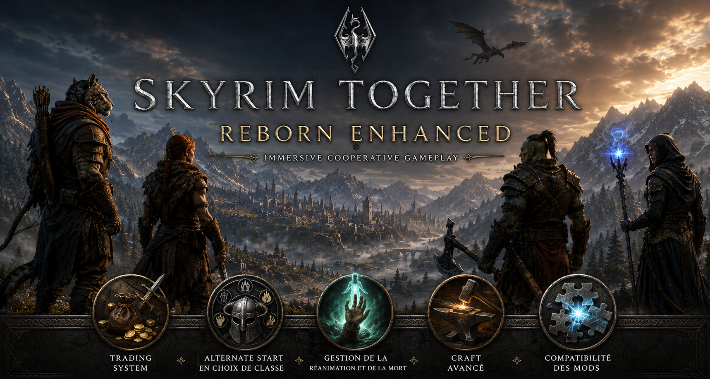
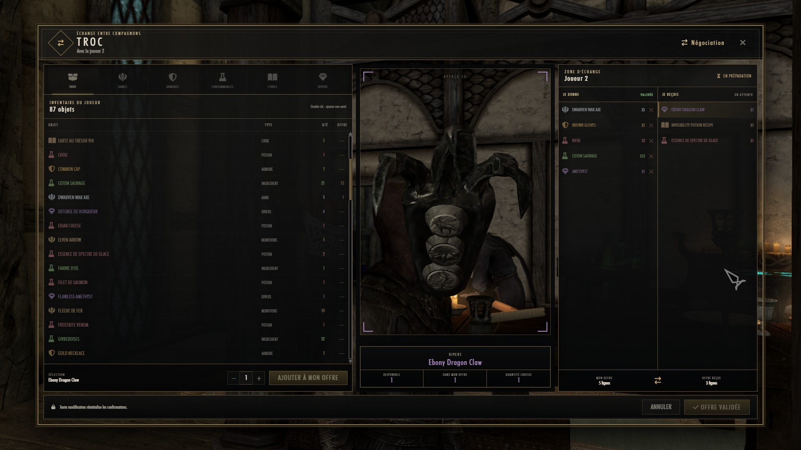
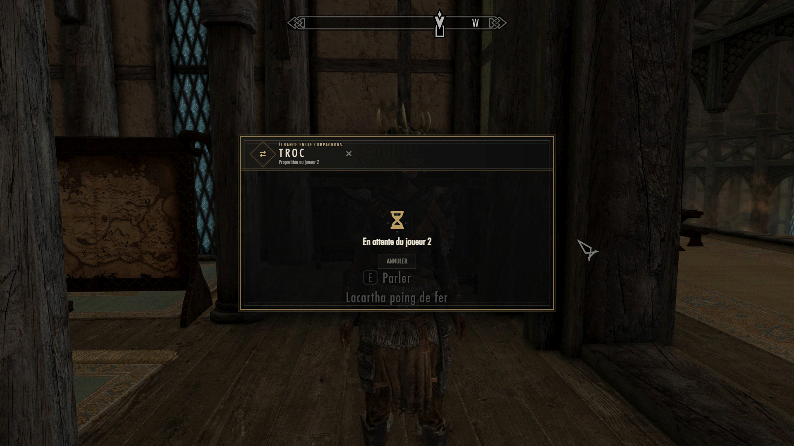

  

# Skyrim Together Reborn Enhanced

> An immersive, systems-driven cooperative fork of Skyrim Together Reborn.

**Skyrim Together Reborn Enhanced (STRE)** extends Skyrim Together Reborn with cooperative mechanics, authoritative multiplayer workflows and a modular foundation for adapting solo Skyrim mods to multiplayer.

STRE is not intended to turn Skyrim into an MMO. The project targets coherent campaigns for small groups, with explicit authority, recovery after disconnects and gameplay systems that remain faithful to Skyrim.

## Implemented today

The first production vertical slice is player-to-player trading:

- authoritative trade sessions on the server;
- revisioned offers, confirmations and bounded protocol messages;
- inventory validation and deterministic mutation plans;
- idempotent client application;
- reconciliation to absolute quantities after uncertain outcomes;
- Angular/CEF trade interface;
- native 3D item preview with automatic framing;
- modular internal preview components;
- dedicated domain, protocol and reconciliation tests.

  

  

The current preview layer is a reusable **internal C++ foundation**. It is not yet a stable third-party mod SDK. See [Current-state audit](docs/audit/CURRENT_STATE_AUDIT.md).

## Next structural vertical slice

**Alternate Start** is planned as the first reference integration for the STRE Mod Integration Framework:

- create campaign-bound characters together;
- skip Helgen and start in a shared inn;
- meet Valen and form the company;
- select cooperative classes;
- keep the plugin fully playable in solo mode;
- describe its multiplayer semantics through a first-party STRE adapter.

Alternate Start, Valen and Campaign State are specified in this repository but were not present in the audited source archive.

## Architecture direction

The target model combines a **microkernel/plugin architecture** with **Ports and Adapters**:

- Skyrim mods keep their solo behavior;
- a `STRE Mod Adapter` declares capabilities, observed state, intents, authority and reconciliation rules;
- STRE owns canonical cooperative state, replication, snapshots and recovery;
- Creation Kit and Papyrus project validated outcomes into the local game.

Read [Mod Integration Framework](docs/architecture/MOD_INTEGRATION_FRAMEWORK.md) and [System overview](docs/architecture/SYSTEM_OVERVIEW.md).

## Documentation

- [Documentation portal](docs/README.md)
- [Executive summary](docs/project/EXECUTIVE_SUMMARY.md)
- [Vision](docs/project/VISION.md)
- [Roadmap](ROADMAP.md)
- [Contributing](CONTRIBUTING.md)
- [Open contributor missions](docs/production/OPEN_ROLES.md)
- [Technical audit](docs/audit/CURRENT_STATE_AUDIT.md)

Detailed design documentation is currently written primarily in French. Code identifiers, commit messages and public issue titles should remain in English.

## Build and development

See [Building STRE](docs/development/BUILDING.md), [Contributing](CONTRIBUTING.md) and [Code guidelines](CODE_GUIDELINES.md).

## Upstream relationship

STRE is maintained as an independent community fork of `tiltedphoques/TiltedEvolution`. The exact audited base and integration policy are recorded in [UPSTREAM.md](UPSTREAM.md) and [Upstream strategy](docs/architecture/UPSTREAM_STRATEGY.md).

## Credits and license

Skyrim Together Reborn Enhanced builds on the work of the Tilted Phoques team and all Skyrim Together Reborn contributors. It is not affiliated with or endorsed by the original team, Bethesda Game Studios or ZeniMax Media.

The project is distributed under the GNU General Public License v3.0. See [LICENSE](LICENSE) and [NOTICE.md](NOTICE.md).
