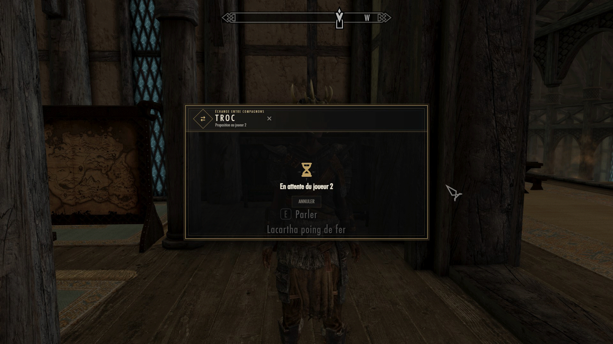

  

# Skyrim Together Reborn Enhanced

> An immersive, systems-driven cooperative fork of Skyrim Together Reborn.

**Skyrim Together Reborn Enhanced (STRE)** extends Skyrim Together Reborn with cooperative mechanics, authoritative multiplayer workflows and a modular foundation for adapting solo Skyrim content to multiplayer.

STRE is not intended to turn Skyrim into an MMO. The project targets coherent campaigns for small groups, with explicit authority, recovery-oriented workflows and gameplay systems that remain faithful to Skyrim.

## Implemented today

### Player-to-player trading

The first production vertical slice is an authoritative trading system:

- server-owned trade sessions;
- revisioned offers, confirmations and bounded protocol messages;
- inventory validation and deterministic mutation plans;
- idempotent client application;
- reconciliation to absolute quantities after uncertain outcomes;
- Angular/CEF trade interface;
- native 3D item preview with automatic framing;
- dedicated domain, protocol and reconciliation tests.

  

  

### Alternate Start character bootstrap

The Alternate Start vertical slice is now present in the repository and has been smoke-tested in Skyrim, including a two-PC cooperative test:

- authored `STRE_AlternateStart.esp`, Papyrus source and compiled PEX are versioned under `GameFiles/Skyrim`;
- the player is moved to the custom inn table and enters RaceMenu through the quest flow;
- Angular/CEF handles class and loadout selection, real item previews and the final summary;
- Warrior, Mage and Thief builds are supported by the shared catalog;
- the server derives canonical inventory and spells from logical selections;
- inventory and spell hashes are acknowledged after local application;
- the same build catalog works offline without a connected STRE server;
- Mage Destruction and Alteration starter spells are implemented;
- targeted cooperative buffs are recognized and synchronized on remote players.

The current character-build catalog version is `BuildVersion = 5`. See [Alternate Start](docs/features/alternate-start/README.md) and [M7 CK/code integration](docs/features/alternate-start/M7_CK_CODE_INTEGRATION.md).

The following parts are **not** complete yet: automatic new-game interception and Helgen bypass, Valen and the full introduction, campaign roster/ready state, durable build persistence, reconnection restoration, and the remaining magic schools.

## Architecture direction

The current code already uses server-authoritative first-party services for trading and character builds. The broader target remains a **microkernel/plugin architecture** with **Ports and Adapters**:

- Skyrim plugins keep a functional solo path where appropriate;
- first-party STRE services translate local game choices into validated intents;
- STRE owns canonical cooperative inventory, spells and future campaign state;
- Creation Kit, Papyrus and native Skyrim code project validated outcomes into each local game;
- a generic third-party adapter SDK will only be stabilized after more first-party integrations.

The item-preview layer is a reusable **internal C++ foundation** and now has a second first-party consumer in Character Creation. It is not yet a stable third-party mod SDK.

Read [System overview](docs/architecture/SYSTEM_OVERVIEW.md), [Mod Integration Framework](docs/architecture/MOD_INTEGRATION_FRAMEWORK.md) and [Current-state audit](docs/audit/CURRENT_STATE_AUDIT.md).

## Documentation

- [Documentation portal](docs/README.md)
- [Current-state audit](docs/audit/CURRENT_STATE_AUDIT.md)
- [Alternate Start](docs/features/alternate-start/README.md)
- [Executive summary](docs/project/EXECUTIVE_SUMMARY.md)
- [Vision](docs/project/VISION.md)
- [Roadmap](ROADMAP.md)
- [Changelog](CHANGELOG.md)
- [Contributing](CONTRIBUTING.md)
- [Open contributor missions](docs/production/OPEN_ROLES.md)

Detailed design documentation is currently written primarily in French. Code identifiers, commit messages and public issue titles should remain in English.

## Build and development

See [Building STRE](docs/development/BUILDING.md), [Contributing](CONTRIBUTING.md) and [Code guidelines](CODE_GUIDELINES.md).

## Upstream relationship

STRE is maintained as an independent community fork of `tiltedphoques/TiltedEvolution`. The audited base and integration policy are recorded in [UPSTREAM.md](UPSTREAM.md) and [Upstream strategy](docs/architecture/UPSTREAM_STRATEGY.md).

## Credits and license

Skyrim Together Reborn Enhanced builds on the work of the Tilted Phoques team and all Skyrim Together Reborn contributors. It is not affiliated with or endorsed by the original team, Bethesda Game Studios or ZeniMax Media.

The project is distributed under the GNU General Public License v3.0. See the repository license file and [NOTICE.md](NOTICE.md).
