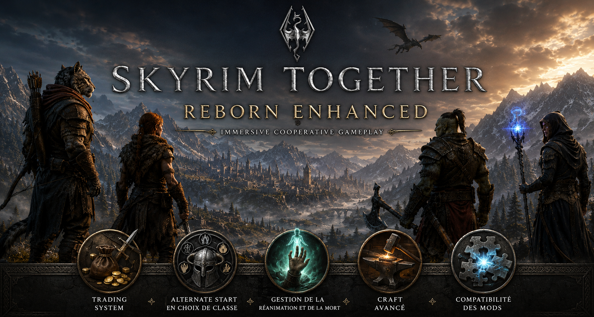
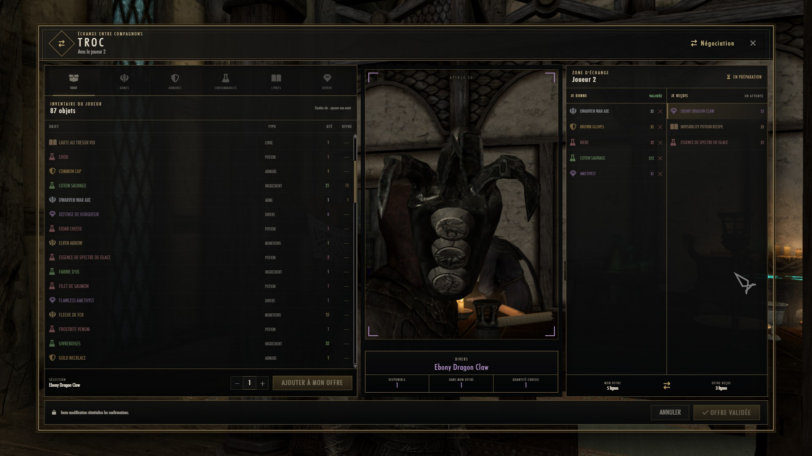

  

# Skyrim Together Reborn Enhanced

> An immersive, systems-driven cooperative fork of Skyrim Together Reborn.

**Skyrim Together Reborn Enhanced (STRE)** extends Skyrim Together Reborn with cooperative mechanics, explicit server authority and systems designed for coherent small-group campaigns without turning Skyrim into an MMO.

## Current capabilities

STRE currently has three substantial first-party verticals:

- **World Sync** — dropped objects use stable `WorldEntityId` identities, local Havok and server-authoritative settlement; movable placed references are lazily adopted; Better Grabbing integration supports multiplayer object manipulation; ownership/stolen provenance is preserved through the supported world/inventory flow.
- **Player-to-player Trading** — authoritative trade sessions, deterministic mutation plans, idempotent client application, reconciliation and native 3D item preview.
- **Alternate Start / Character Build** — custom inn bootstrap, RaceMenu + Angular character creation, shared class/loadout catalog, canonical inventory/spells and a solo fallback.

See [Current project status](docs/project/STATUS.md) for the maintained implementation/validation snapshot.

  

  

## Architecture principles

STRE follows a few explicit rules:

- shared mutable state has a declared authority;
- network messages express intents and canonical outcomes rather than trusting local presentation state;
- Skyrim/CK/UI layers project state but do not silently become its source of truth;
- network-triggered Skyrim mutations run on the game update path;
- local engine simulation is reused when it is already the correct abstraction;
- third-party integration contracts are generalized only after first-party use validates them;
- features fail closed when metadata cannot be preserved safely.

Read [System overview](docs/architecture/SYSTEM_OVERVIEW.md), [Network protocol rules](docs/architecture/NETWORK_PROTOCOL.md) and the [ADR index](docs/architecture/ADRs/).

## Documentation

- [Documentation portal](docs/README.md)
- [Current project status](docs/project/STATUS.md)
- [Vision](docs/project/VISION.md)
- [Roadmap](ROADMAP.md)
- [World Sync](docs/features/world-sync/README.md)
- [Trading](docs/features/trading/README.md)
- [Alternate Start](docs/features/alternate-start/README.md)
- [Compatibility matrix](docs/testing/COMPATIBILITY_MATRIX.md)
- [Changelog](CHANGELOG.md)
- [Contributing](CONTRIBUTING.md)

Detailed design documentation is currently written primarily in French. Code identifiers, commit messages and public issue titles should remain in English.

## Build and development

See [Building STRE](docs/development/BUILDING.md), [Contributing](CONTRIBUTING.md) and [Code guidelines](CODE_GUIDELINES.md).

## Upstream relationship

STRE is maintained as an independent community fork of `tiltedphoques/TiltedEvolution`.

- [Current upstream baseline](UPSTREAM.md)
- [Upstream integration strategy](docs/architecture/UPSTREAM_STRATEGY.md)

## Credits and license

Skyrim Together Reborn Enhanced builds on the work of the Tilted Phoques team and all Skyrim Together Reborn contributors. It is not affiliated with or endorsed by the original team, Bethesda Game Studios or ZeniMax Media.

The project is distributed under the GNU General Public License v3.0. See the repository license file and [NOTICE.md](NOTICE.md).
